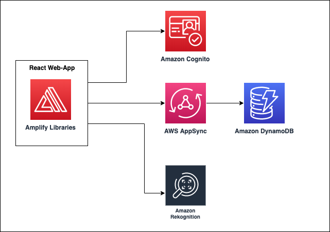

## Build an AI Powered App Using AWS Amplify

## Objective
This application harnesses advanced Computer Vision technology to automatically identify items within supported images, thereby enhancing human productivity and reducing the likelihood of human error.

## Technology Stack
Amplify, AppSync, DynamoDB, Cognito and Rekognition.

## Innovation
A cutting-edge computer vision solution powered by AWS Amplify that leverages advanced machine learning algorithms to automatically detect and classify items within images. This application transforms visual data into actionable insights, demonstrating the potential of AI-driven image recognition technology

## AWS Amplify Hosting URL for the App 
https://dev.d3nolp5jzwoq65.amplifyapp.com/

## Architecture 

The below diagram shows the architecture of the App - A react front-end utilizes AppSync graphql server to create, read, delete items to a DynamoDB database. We also have an integration with Amazon Rekognition which provides Computer Vision capabilities to detect objects in images that are used as labels to create the shopping list items. 

## Setup instructions
**Clone this repo**
https://github.com/ajitnk-lab/ai-powered-amplify-hackathon-app?tab=readme-ov-file

**Install dependencies**
'npm install'

**Install the Amplify CLI globally**
npm install -g @aws-amplify/cli

**Initialize Amplify** 
amplify init --y

**Install Amplify javascript libraries**
npm install --save aws-amplify@4.2.9 @aws-amplify/ui-react@1.2.15

**Add Amplify Categories**
amplify add auth
amplify add api
amplify add predictions
amplify add hosting
amplify push
amplify publish

**Cleanup**
amplify delete

## Security

See [CONTRIBUTING](CONTRIBUTING.md#security-issue-notifications) for more information.

## License

This sample is licensed under the MIT-0 License. See the LICENSE file.
